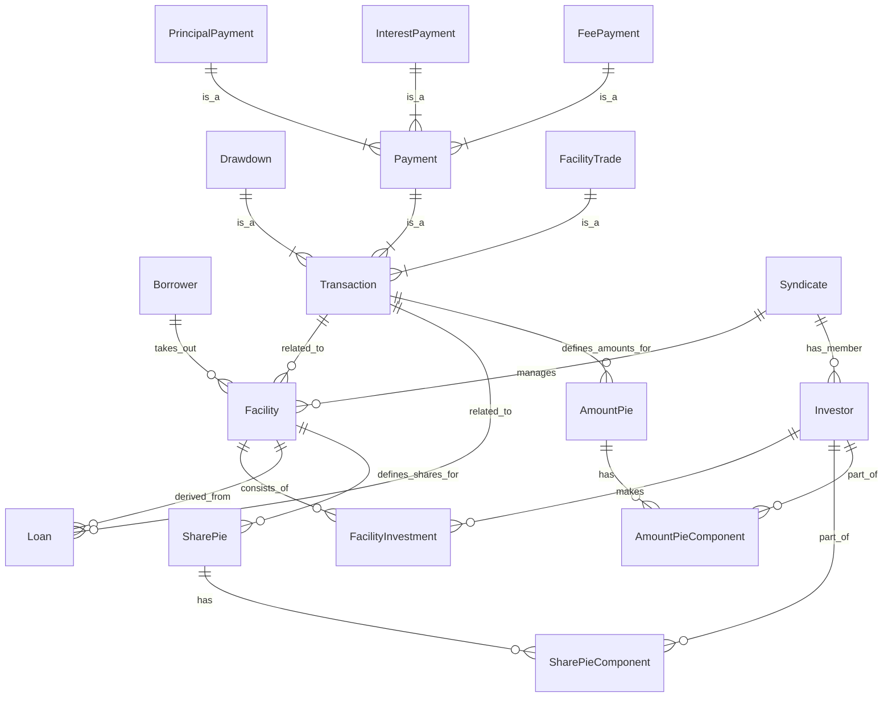

# System Patterns: Syndicated Loan Management System

## 1. Architecture Overview

### 1.1 Layer Architecture (Lightweight DDD / 3-Tier)

本システムは、実用的な3層アーキテクチャ（Controller-Service-Repository）を基本とし、必要に応じてドメイン層の分離や拡張が可能な「軽量級DDD」構造を採用します。

- **Entity/Domain**: JPAエンティティ兼ドメインエンティティ（@Entity, @Table, @Id など）
- **Repository**: Spring Data JPAインターフェース
- **Service**: 業務ロジックを担うサービスクラス（@Service, @Transactional）
- **Controller**: REST APIエンドポイント（@RestController）
- **DTO**: APIリクエスト/レスポンス用DTO

#### パッケージ構成例

```
com.example.syndicatelending/
├── common/         # 共通値オブジェクト・例外
├── party/          # 参加者（Company, Borrower, Investor）
│   ├── entity/
│   ├── repository/
│   ├── service/
│   ├── controller/
│   └── dto/
├── syndicate/      # シンジケート団
│   ├── entity/
│   ├── repository/
│   ├── service/
│   ├── controller/
│   └── dto/
├── facility/       # 融資枠
│   ├── entity/
│   ├── repository/
│   ├── service/
│   ├── controller/
│   └── dto/
├── loan/           # 貸付・返済
│   ├── entity/
│   ├── repository/
│   ├── service/
│   ├── controller/
│   └── dto/
└── ...
```

- 各Bounded Contextごとに entity/repository/service/controller/dto を持つシンプルな構成
- position/domainは、FacilityやLoanなど複数コンテキストで共通利用される「純粋なドメインモデル（POJO）」を集約する役割。JPA非依存で業務ロジックや値オブジェクトを表現する。
- 必要に応じて、将来的にdomain.modelやdomain.service等の分離も可能

---

## 2. Design Patterns

- DDDの原則は意識しつつも、現状は「軽量級DDD」構造（3層＋DTO）を基本とする
- ドメインの複雑化や業務要件の高度化に応じて、段階的に重量級DDD構造へ発展可能

1.  **Entity（エンティティ）:**
    *   明確な識別子を持つ可変な概念を表現します（例: `Facility`, `Drawdown`）。
    *   エンティティに関連する業務ロジックと状態をカプセル化します。
    *   JPAで管理される自動生成IDとは別の **Business ID**（例: UUID）で識別されます。
2.  **Value Object（値オブジェクト）:**
    *   概念的な識別子を持たないドメインの記述的側面を表現します（例: `Money`, `Percentage`, `FacilityId`, `TransactionId`）。
    *   不変であり、値として扱われます。
    *   その値に固有の関連データとドメインロジックをカプセル化します（例: `Money.add()`, `Percentage.applyTo(Money)`）。
3.  **Aggregate（集約）:**
    *   データ変更の単一単位として扱われるEntityとValue Objectの集まりです。Aggregate Rootは主要なエンティティの参照ポイントです（例: `Facility`, `Drawdown`がAggregate Rootになる可能性があります）。
    *   単一トランザクション内での境界内データの一貫性を保証します。
4.  **Repositories:**
    *   Spring Data JPAインターフェースを使用したデータアクセス層
    *   各Bounded Contextの `repository` パッケージに配置
    *   JPAエンティティを操作して永続化を行う

### 2.2 Service Pattern

Serviceクラスは業務ロジックとトランザクション管理を担当します。

1.  **Service Classes:**
    *   各Bounded Contextの `service` パッケージに配置（例: `FacilityService`）
    *   業務ロジックの実装とワークフローの制御
    *   トランザクション境界の管理（`@Transactional`）
    *   RepositoryとEntityを協調させた業務処理の実装

### 2.3 Controller Pattern

Controllerクラスは外部からの入り口となるREST APIエンドポイントです。

1.  **REST Controllers:**
    *   各Bounded Contextの `controller` パッケージに配置
    *   HTTPリクエスト/レスポンスの処理
    *   Request DTOの受け取りとResponse DTOの返却
    *   Serviceクラスへの処理委譲
    *   薄いレイヤとして、業務ロジックはServiceに委ねる

## 3. Key Technical Decisions

### 3.1 エラーハンドリング

*   **階層化例外:** Domainレイヤはドメイン固有の例外を投げます（例: `InsufficientFundsException`）。Applicationレイヤはドメイン例外をキャッチし、アプリケーションレベルで意味のあるApplication固有の例外（`ResourceNotFoundException`, `BusinessRuleViolationException`）を投げます。
*   **Global Exception Handler (`common.infrastructure.api.GlobalExceptionHandler`):** Application例外（およびバリデーションエラーなどの標準フレームワーク例外）をキャッチし、適切なHTTPステータスコードと構造化されたエラーレスポンスにマッピングする`@RestControllerAdvice`コンポーネントです。
*   **構造化エラーレスポンス:** APIはステータス、エラータイプ、メッセージを含む一貫したJSON形式でエラーを返します。

### 3.2 永続化 (JPA)

*   **自動生成ID:** JPAエンティティにはデータベース生成のプライマリキー（例: `IDENTITY`戦略の`Long`）を使用します。
*   **Repository実装:** データベースとの相互作用にSpring Data JPAインターフェース（`JpaRepository`）を使用します。

### 3.3 テスト

*   **階層化テスト戦略:**
    *   **ドメイン単体テスト:** Domain Entity、Value Object、Domain Serviceに焦点を当てます。純粋なJava、依存関係なし、非常に高速です。コアビジネスルールと計算を検証します。
    *   **Serviceテスト:** Serviceクラスに焦点を当てます。Repositoryインターフェースと外部サービスにモックを使用して、ビジネスワークフローのオーケストレーションをテストします。ユースケース実行フローとエラーハンドリングを検証します。
    *   **結合テスト:** APIと永続化レイヤに焦点を当てます。概念と外部技術（DB、API）間のマッピングをテストします。これらのテストは低速で、実行中のデータベース/APIエンドポイントが必要です。
*   **Repositoryモック:** 高速で分離されたServiceテストに不可欠です。ServiceテストでRepositoryインターフェースをモックします。

## 4. EventSourcingについての検討と判断

本システムでは、FacilityやLoan（Transaction）など履歴や状態遷移が本質的な価値となる集約についてはEventSourcingの採用を検討しました。しかし、現時点でのSyndicateコンテキストは主に静的な構成情報（団体名、リードバンク、メンバー投資家リスト等）を管理するものであり、状態遷移や履歴管理の複雑さが少ないため、実利を重んじてEventSourcingは見送り、通常のエンティティ永続化方式を採用しています。

今後、FacilityやLoanなどで履歴管理や監査要件が高まった場合には、段階的にEventSourcingの導入を再検討します。

## 5. データモデル（概念）

識別されたコアエンティティと関係に基づく：


*（注：これはドメイン概念に基づく概念的なER図です。継承や埋め込みオブジェクトなどのマッピングの関係により、実際のJPAエンティティの関係は若干異なる場合があります。）*

## 6. トランザクションパターン

複雑なトランザクション処理は、`transaction` Bounded Contextで処理されるこのシステムの中核部分です。

1.  **支払い処理（利息、元本、手数料）:**
    *   `Loan`残高、金利、手数料タイプ、日付に基づく計算を含みます。
    *   `Share Pie`に基づいて受け取った支払い金額を個々の投資家に分配し、`Amount Pie`を作成します。
    *   `Loan`残高の更新（元本支払いの場合）。
    *   特定の`Payment`トランザクション（`InterestPayment`, `PrincipalPayment`, `FeePayment`）の記録。
    *   Domain Service（`FundDistributionService`）が複雑な計算と分配ロジックを処理します。
2.  **取引決済（Facility Trade）:**
    *   売却投資家から購入投資家への`Facility`（および関連する`Loan`の可能性もある）の一部の譲渡を含みます。
    *   影響を受ける`Facility`（および`Loan`）の`Share Pie`の更新が必要です。
    *   `Facility Trade`トランザクションの記録。
    *   売却投資家と購入投資家間の資金決済を含む場合があります。

## 7. 統合パターン

### 7.1 REST APIs

*   各Bounded Contextの `controller` パッケージ内でREST APIエンドポイントを提供
*   RESTful原則に従い、リソースベースのエンドポイント（`/api/v1/facilities`, `/api/v1/syndicates` など）と標準HTTPメソッドを使用
*   Request/Response DTOを利用してAPIの外部契約を定義
*   Global Exception Handlerで一貫したエラーレスポンス形式と適切なHTTPステータスコードを保証

### 7.2 データ転送 (DTOs)

*   **DTOs** (`dto`): API境界でのリクエスト/レスポンスのシリアライゼーション/デシリアライゼーションに使用
*   **バリデーション:** Bean Validation（`@Valid`）をRequest DTOに適用。より深いビジネスバリデーションはServiceやDomainレイヤで実行

---

# Bounded Context（バウンデッドコンテキスト）について

本ドキュメントで示す `common`, `party`, `syndicate`, `facility`, `loan` などのパッケージは、DDD（ドメイン駆動設計）における「Bounded Context（バウンデッドコンテキスト）」を指します。

- **Bounded Context（バウンデッドコンテキスト）** とは、業務全体（ドメイン）を意味的・機能的に分割した業務領域の単位です。
- 各Bounded Contextは、独立した業務的責任やルールを持ち、システム全体の複雑さを分割統治する役割を担います。
- 例: `party`（参加者管理）、`syndicate`（シンジケート団管理）、`facility`（融資枠管理）、`loan`（貸付・返済管理）など。

この構成により、各Bounded Contextごとに entity/repository/service/controller/dto などのレイヤを持つことで、責任の分離と保守性・拡張性の高い設計を実現します。

---
