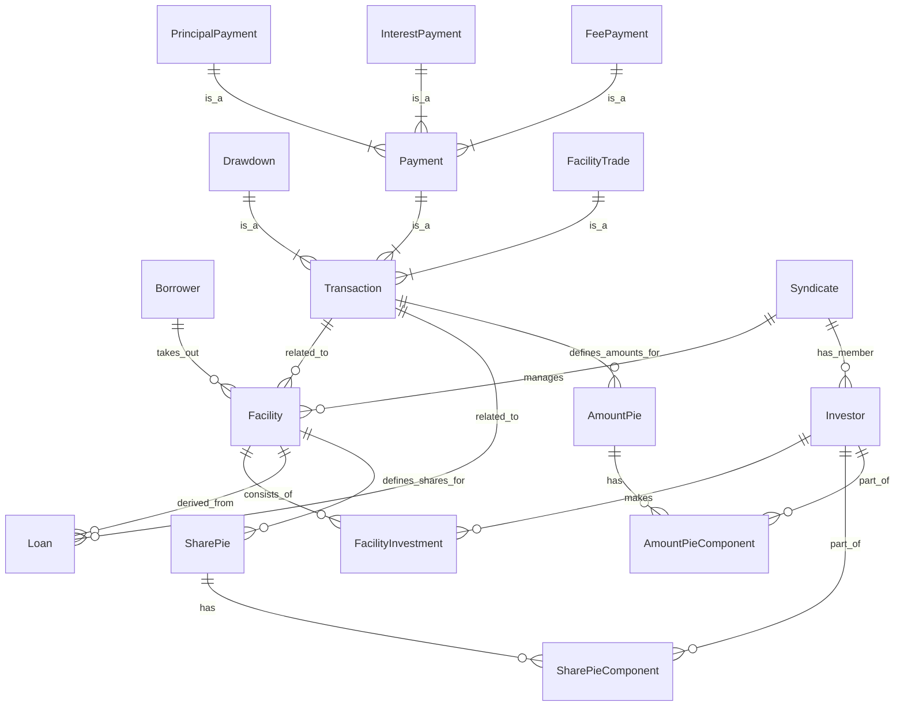

# System Patterns: Syndicated Loan Management System

## ⚠️ システムの基本設計思想

**本システムは、ドメイン貧血症という非難を受けようとも、仕様書の通り愚直にControllerに処理を連ねることを最大の特徴としています。**

これは以下の理由に基づいた意図的な設計判断です：
- **仕様の透明性**: 仕様書とコードの対応関係を明確にし、要件変更時の影響範囲を特定しやすくする
- **実装の単純さ**: 過度な抽象化を避け、業務フローを直接的にコードで表現する
- **保守性の優先**: 複雑な設計パターンよりも、理解しやすく修正しやすいコード構造を重視する

## 1. Architecture Overview

### 1.1 Layer Architecture (Controller-Centric / 2-Tier)

本システムは、**Controllerに業務ロジックを集約する**実用的な2層アーキテクチャを採用します。これは仕様書とコードの直接的な対応を重視した設計判断です。

- **Entity/Domain**: JPAエンティティ兼ドメインエンティティ（@Entity, @Table, @Id など）
- **Repository**: Spring Data JPAインターフェース（データアクセスのみ）
- **Controller**: **業務ロジックの中心地**（@RestController） - 仕様書の処理フローをそのまま実装
- **DTO**: APIリクエスト/レスポンス用DTO

#### パッケージ構成例

```
com.example.syndicatelending/
├── common/         # 共通値オブジェクト・例外・インフラストラクチャ
├── controller/     # 全てのREST APIエンドポイント（業務ロジック実装）
├── domain/         # ドメイン固有の値オブジェクトとビジネスルール
├── dto/            # APIリクエスト/レスポンス用DTO
├── entity/         # JPAエンティティ（全業務領域共通）
└── repository/     # Spring Data JPAリポジトリ（全業務領域共通）
```

- **機能横断的なレイヤー構造**を採用し、複雑なパッケージ分割を避ける

---

## 2. Design Patterns

- 業務ロジックはControllerに直接実装し、仕様書とコードの対応を明確にする

## ⚠️ Service層実装禁止方針

**本システムではService層の実装を明示的に禁止しています。**

### 禁止理由

1. **仕様書とコードの直接対応の維持**：Service層を挟むことで、仕様書に記載された処理フローとコードの対応関係が不明瞭になり、要件変更時の影響範囲特定が困難になる

2. **不要な抽象化の排除**：業務ロジックをControllerからServiceに分離することは、本システムにおいては過度な抽象化であり、コードの複雑性を増加させる要因となる

3. **保守性の向上**：処理の流れがController内に集約されることで、開発者は一箇所を見るだけで業務フローの全体像を把握でき、保守性が向上する

4. **デバッグ効率の最適化**：処理が複数レイヤーに分散せず、Controller内に集約されているため、問題発生時のデバッグが効率的に行える

5. **学習コストの削減**：新規参画者がシステムを理解する際、複雑なレイヤー構造を学習する必要がなく、業務ロジックに集中できる

### 代替アプローチ

- **Repository直接呼び出し**：ControllerからRepository を直接呼び出す
- **@Transactional の Controller適用**：必要に応じてController メソッドに@Transactional を適用してトランザクション管理を行う
- **共通処理のユーティリティ化**：共通処理は static メソッドやユーティリティクラスとして実装する

1.  **Entity（エンティティ）:**
    *   明確な識別子を持つ可変な概念を表現します（例: `Facility`, `Drawdown`）。
    *   エンティティに関連する業務ロジックと状態をカプセル化します。
    *   JPAで管理される自動生成IDとは別の **Business ID**（例: UUID）で識別されます。
2.  **Value Object（値オブジェクト）:**
    *   概念的な識別子を持たないドメインの記述的側面を表現します（例: `Money`, `Percentage`, `FacilityId`, `TransactionId`）。
    *   不変であり、値として扱われます。
    *   その値に固有の関連データとドメインロジックをカプセル化します（例: `Money.add()`, `Percentage.applyTo(Money)`）。
3.  **Aggregate（集約）:**
    *   データ変更の単一単位として扱われるEntityとValue Objectの集まりです。Aggregate Rootは主要なエンティティの参照ポイントです（例: `Facility`, `Drawdown`がAggregate Rootになる可能性があります）。
    *   単一トランザクション内での境界内データの一貫性を保証します。
4.  **Repositories:**
    *   Spring Data JPAインターフェースを使用したデータアクセス層
    *   `repository` パッケージに配置
    *   JPAエンティティを操作して永続化を行う

### 2.2 Controller Pattern

Controllerクラスは**業務ロジックの中心地**として機能するREST APIエンドポイントです。

1.  **REST Controllers:**
    *   `controller` パッケージに配置
    *   HTTPリクエスト/レスポンスの処理
    *   Request DTOの受け取りとResponse DTOの返却
    *   **業務ロジックの直接実装**（仕様書との対応を重視）
    *   Repository を直接呼び出し、必要に応じて@Transactional を適用

## 3. Key Technical Decisions

### 3.1 エラーハンドリング

*   **階層化例外:** Domainレイヤはドメイン固有の例外を投げます（例: `InsufficientFundsException`）。Applicationレイヤはドメイン例外をキャッチし、アプリケーションレベルで意味のあるApplication固有の例外（`ResourceNotFoundException`, `BusinessRuleViolationException`）を投げます。
*   **構造化エラーレスポンス:** APIはステータス、エラータイプ、メッセージを含む一貫したJSON形式でエラーを返します。

### 3.2 永続化 (JPA)

*   **自動生成ID:** JPAエンティティにはデータベース生成のプライマリキー（例: `IDENTITY`戦略の`Long`）を使用します。
*   **Repository実装:** データベースとの相互作用にSpring Data JPAインターフェース（`JpaRepository`）を使用します。

### 3.3 テスト

*   **階層化テスト戦略:**
    *   **ドメイン単体テスト:** Domain Entity、Value Object、Domain Serviceに焦点を当てます。純粋なJava、依存関係なし、非常に高速です。コアビジネスルールと計算を検証します。
    *   **結合テスト:** APIと永続化レイヤに焦点を当てます。概念と外部技術（DB、API）間のマッピングをテストします。これらのテストは低速で、実行中のデータベース/APIエンドポイントが必要です。

## 4. データモデル（概念）

識別されたコアエンティティと関係に基づく：


*（注：これはドメイン概念に基づく概念的なER図です。継承や埋め込みオブジェクトなどのマッピングの関係により、実際のJPAエンティティの関係は若干異なる場合があります。）*

## 5. トランザクションパターン

複雑なトランザクション処理は、`transaction` Bounded Contextで処理されるこのシステムの中核部分です。

1.  **支払い処理（利息、元本、手数料）:**
    *   `Loan`残高、金利、手数料タイプ、日付に基づく計算を含みます。
    *   `Share Pie`に基づいて受け取った支払い金額を個々の投資家に分配し、`Amount Pie`を作成します。
    *   `Loan`残高の更新（元本支払いの場合）。
    *   特定の`Payment`トランザクション（`InterestPayment`, `PrincipalPayment`, `FeePayment`）の記録。
    *   Domain Service（`FundDistributionService`）が複雑な計算と分配ロジックを処理します。
2.  **取引決済（Facility Trade）:**
    *   売却投資家から購入投資家への`Facility`（および関連する`Loan`の可能性もある）の一部の譲渡を含みます。
    *   影響を受ける`Facility`（および`Loan`）の`Share Pie`の更新が必要です。
    *   `Facility Trade`トランザクションの記録。
    *   売却投資家と購入投資家間の資金決済を含む場合があります。

## 6. 統合パターン

### 6.1 REST APIs

*   `controller` パッケージ内でREST APIエンドポイントを提供
*   RESTful原則に従い、リソースベースのエンドポイント（`/api/v1/facilities`, `/api/v1/syndicates` など）と標準HTTPメソッドを使用
*   Request/Response DTOを利用してAPIの外部契約を定義

### 6.2 データ転送 (DTOs)

*   **DTOs** (`dto`): API境界でのリクエスト/レスポンスのシリアライゼーション/デシリアライゼーションに使用
*   **バリデーション:** Bean Validation（`@Valid`）をRequest DTOに適用。より深いビジネスバリデーションはServiceやDomainレイヤで実行
