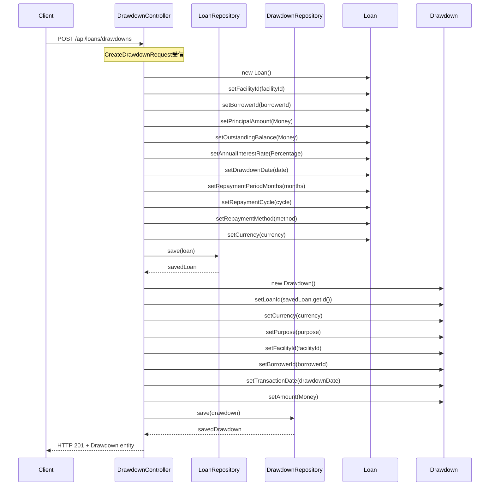

# Loan Bounded Context - Drawdown作成処理フロー

## 概要

ドローダウン（資金引き出し）作成処理の流れを説明します。POSTエンドポイント `/api/loans/drawdowns` を起点とした処理フローを詳述します。

**特徴**: 本システムの設計思想に従い、Controllerに業務ロジックを直接実装し、仕様書とコードの対応を明確にしています。

## 処理フロー概要

1. **CreateDrawdownRequest受信** - リクエストデータの受け取り
2. **Loan作成** - ドローダウンに対応するLoanエンティティの作成
3. **Drawdown作成** - Transaction継承したDrawdownエンティティの作成
4. **データ永続化** - Loan、Drawdownの順次保存
5. **レスポンス返却** - 作成されたDrawdownエンティティの返却

## シーケンス図



## 詳細処理フロー

### 1. リクエスト受信
- **エンドポイント**: `POST /api/loans/drawdowns`
- **Content-Type**: `application/json`
- **リクエストボディ**: `CreateDrawdownRequest`

### 2. Loanエンティティ作成・設定

#### 2.1 Loanインスタンス生成
```java
Loan loan = new Loan();
```

#### 2.2 基本情報設定
- **facilityId**: ファシリティID（外部キー）
- **borrowerId**: 借り手ID（外部キー）
- **currency**: 通貨コード（例: JPY, USD）

#### 2.3 金額・金利設定
- **principalAmount**: `Money.of(request.getAmount())` - 元本金額
- **outstandingBalance**: `Money.of(request.getAmount())` - 初期残高（元本と同額）
- **annualInterestRate**: `Percentage.of(request.getAnnualInterestRate())` - 年利率

#### 2.4 返済条件設定
- **drawdownDate**: ドローダウン実行日
- **repaymentPeriodMonths**: 返済期間（月数）
- **repaymentCycle**: 返済サイクル（例: "MONTHLY"）
- **repaymentMethod**: 返済方法（例: "EQUAL_INSTALLMENT"）

### 3. Loanエンティティ永続化
- **Repository**: `LoanRepository.save(loan)`
- **戻り値**: `savedLoan` - 保存されたLoanエンティティ（IDが自動生成済み）

### 4. Drawdownエンティティ作成・設定

#### 4.1 Drawdownインスタンス生成
```java
Drawdown drawdown = new Drawdown();
```
- **継承関係**: `Drawdown extends Transaction`
- **自動設定**: `transactionType = "DRAWDOWN"`（コンストラクタで設定）

#### 4.2 基本情報設定
- **loanId**: 保存されたLoanのID（`savedLoan.getId()`）
- **currency**: 通貨コード
- **purpose**: ドローダウン目的

#### 4.3 Transaction継承フィールド設定
- **facilityId**: ファシリティID
- **borrowerId**: 借り手ID
- **transactionDate**: ドローダウン実行日
- **amount**: `Money.of(request.getAmount())` - 取引金額

### 5. Drawdownエンティティ永続化
- **Repository**: `DrawdownRepository.save(drawdown)`
- **戻り値**: `savedDrawdown` - 保存されたDrawdownエンティティ

### 6. レスポンス返却
- **HTTPステータス**: 201 Created
- **Content-Type**: `application/json`
- **レスポンスボディ**: 作成された`Drawdown`エンティティ（JSON形式）

## リクエスト・レスポンス例

### リクエスト例
```json
POST /api/loans/drawdowns
Content-Type: application/json

{
  "facilityId": 1,
  "borrowerId": 1,
  "amount": 1000000,
  "currency": "JPY",
  "purpose": "設備投資",
  "annualInterestRate": 0.025,
  "drawdownDate": "2025-06-06",
  "repaymentPeriodMonths": 36,
  "repaymentCycle": "MONTHLY",
  "repaymentMethod": "EQUAL_INSTALLMENT"
}
```

### レスポンス例
```json
HTTP/1.1 201 Created
Content-Type: application/json

{
  "id": 1,
  "loanId": 1,
  "currency": "JPY",
  "purpose": "設備投資",
  "facilityId": 1,
  "borrowerId": 1,
  "transactionDate": "2025-06-06",
  "transactionType": "DRAWDOWN",
  "amount": {
    "amount": 1000000,
    "currency": "JPY"
  },
  "createdAt": "2025-06-06T10:30:00",
  "updatedAt": "2025-06-06T10:30:00",
  "version": 0
}
```
