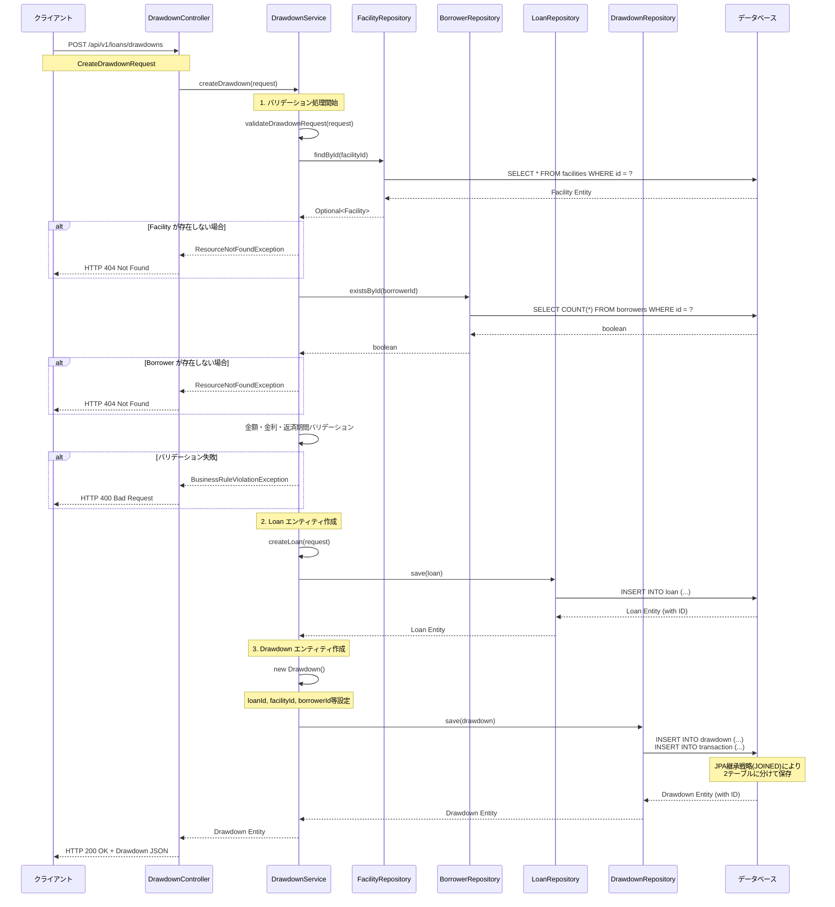
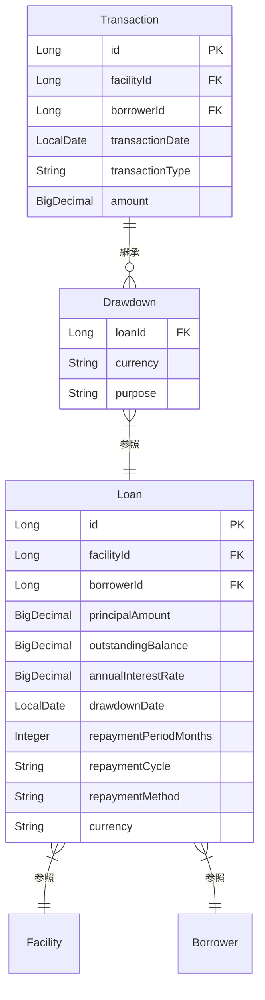

# Loan Bounded Context - Drawdown作成処理フロー

## 概要

Loan Bounded Contextにおけるドローダウン（資金引き出し）作成処理の流れを説明します。POSTエンドポイント `/api/v1/loans/drawdowns` を起点とした処理フローを詳述します。

## シーケンス図

## 処理の詳細説明

### 1. エンドポイント受付
- **URL**: `POST /api/v1/loans/drawdowns`
- **Controller**: `DrawdownController.createDrawdown()`
- **リクエスト**: `CreateDrawdownRequest` DTO

### 2. バリデーション処理
`DrawdownService.validateDrawdownRequest()` で以下をチェック：

#### 2.1 参照整合性チェック
- **Facility存在確認**: `FacilityRepository.findById()` でファシリティの存在を確認
- **Borrower存在確認**: `BorrowerRepository.existsById()` で借り手の存在を確認

#### 2.2 ビジネスルールチェック
- **金額妥当性**: ドローダウン金額が正の値であることを確認
- **融資枠チェック**: ドローダウン金額がファシリティのコミットメント額を超えないことを確認
- **金利妥当性**: 年利が負の値でないことを確認
- **返済期間妥当性**: 返済期間（月数）が正の値であることを確認

### 3. エンティティ作成処理

#### 3.1 Loan エンティティ作成
`DrawdownService.createLoan()` で以下の情報を設定：
- **基本情報**: facilityId, borrowerId, 通貨
- **金額情報**: 元本金額、残高（初期値は元本と同じ）
- **金利情報**: 年利
- **返済情報**: 返済期間、返済サイクル、返済方法
- **日付情報**: ドローダウン実行日

#### 3.2 Drawdown エンティティ作成
`Transaction` を継承した `Drawdown` エンティティを作成：
- **継承元フィールド**: facilityId, borrowerId, transactionDate, amount, transactionType
- **固有フィールド**: loanId, currency, purpose
- **継承戦略**: `@Inheritance(strategy = InheritanceType.JOINED)` により、`transaction` テーブルと `drawdown` テーブルに分けて保存

### 4. データ永続化
- **Loan保存**: `LoanRepository.save()` でLoanテーブルに保存
- **Drawdown保存**: `DrawdownRepository.save()` でTransaction/Drawdownテーブルに保存
- **トランザクション**: `@Transactional` により全体が単一トランザクションで実行

### 5. レスポンス返却
- 作成された `Drawdown` エンティティをJSONとしてクライアントに返却
- HTTPステータス: 200 OK

## エラーハンドリング

### ResourceNotFoundException (HTTP 404)
- Facility が存在しない場合
- Borrower が存在しない場合

### BusinessRuleViolationException (HTTP 400)
- ドローダウン金額が0以下の場合
- ドローダウン金額がファシリティのコミットメント額を超える場合
- 年利が負の値の場合
- 返済期間が0以下の場合

## データモデル関係

## 主要な設計パターン

### 1. 継承戦略
- **JOINED継承**: `Transaction` 基底クラスから `Drawdown` が継承
- **テーブル分離**: `transaction` テーブルと `drawdown` テーブルに分けて保存

### 2. バリデーション戦略
- **段階的バリデーション**: 参照整合性 → ビジネスルール の順で実行
- **早期リターン**: エラー発生時は即座に例外をスロー

### 3. トランザクション管理
- **単一トランザクション**: Loan作成とDrawdown作成を一つのトランザクションで実行
- **ロールバック**: エラー発生時は全ての変更をロールバック

---

**注記**: この処理フローは現在の実装に基づいており、将来的にAmountPie（金額配分）やイベント処理などの機能が追加される可能性があります。
