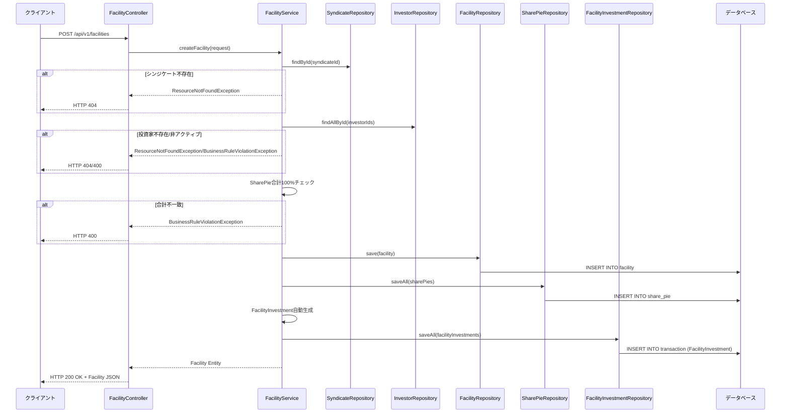
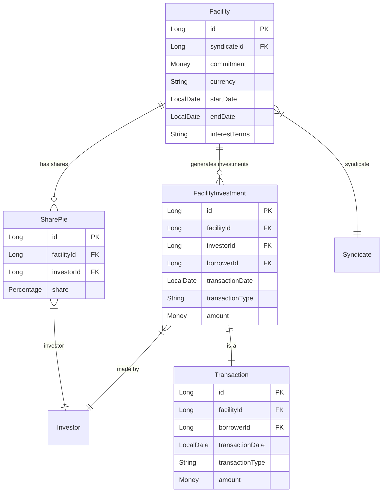

# Facility Bounded Context - Facility作成処理フロー

## 概要

Facility Bounded Contextにおけるファシリティ（融資枠）作成処理の流れを説明します。POSTエンドポイント `/api/v1/facilities` を起点とした処理フローを記載します。

## シーケンス図

## 処理の詳細説明

### 1. エンドポイント受付
- **URL**: `POST /api/v1/facilities`
- **Controller**: `FacilityController.createFacility()`
- **リクエスト**: `CreateFacilityRequest` DTO

### 2. バリデーション処理
`FacilityService`で以下をチェック：

#### 2.1 参照整合性チェック
- **シンジケート存在確認**: `SyndicateRepository.findById()` でシンジケートの存在を確認
- **投資家存在・アクティブ確認**: `InvestorRepository.findAllById()` で投資家の存在とアクティブ状態を確認

#### 2.2 ビジネスルールチェック
- **SharePie合計100%チェック**: 投資家持分比率（SharePie）の合計が100%であることを確認

### 3. エンティティ作成処理

#### 3.1 Facilityエンティティ作成
- **基本情報**: syndicateId, commitment, currency, startDate, endDate, interestTerms等
- **監査フィールド**: created_at, updated_at, version

#### 3.2 SharePieエンティティ作成
- **投資家ごとの持分比率**: investorId, share, facilityId

#### 3.3 FacilityInvestment自動生成
- **投資家ごとの投資記録**: SharePie比率に基づいて按分計算
- **按分計算**: commitment × share比率 → Money型で設定
- **borrowerId取得**: Facility → Syndicate → BorrowerIdの関連で取得
- **取引情報**: transactionType="FACILITY_INVESTMENT", transactionDate=現在日付

### 4. データ永続化
- **Facility保存**: `FacilityRepository.save()` でfacilityテーブルに保存
- **SharePie保存**: `SharePieRepository.saveAll()` でshare_pieテーブルに一括保存
- **FacilityInvestment保存**: `FacilityInvestmentRepository.saveAll()` でtransactionテーブルに一括保存
- **トランザクション**: `@Transactional` により全体が単一トランザクションで実行

### 5. レスポンス返却
- 作成された `Facility` エンティティをJSONとしてクライアントに返却
- HTTPステータス: 200 OK

## エラーハンドリング

### ResourceNotFoundException (HTTP 404)
- シンジケートが存在しない場合
- 投資家が存在しない場合

### BusinessRuleViolationException (HTTP 400)
- 投資家が非アクティブの場合
- SharePie合計が100%でない場合

## データモデル関係

## 主要な設計パターン

### 1. バリデーション戦略
- **段階的バリデーション**: 参照整合性 → ビジネスルール
- **早期リターン**: エラー発生時は即座に例外をスロー

### 2. トランザクション管理
- **単一トランザクション**: Facility作成、SharePie作成、FacilityInvestment作成を一つのトランザクションで実行
- **ロールバック**: エラー発生時は全ての変更をロールバック

### 3. FacilityInvestment自動生成
- **業務的意味**: 投資家がFacilityに対して行った投資を記録
- **按分計算**: 各投資家の投資額 = Facility総額 × その投資家のSharePie比率
- **取引記録**: Transactionテーブルに投資記録として保存

---

**注記**: この処理フローは現在の実装に基づいており、将来的に複雑なバリデーションやイベント処理が追加される可能性があります。FacilityInvestment自動生成機能により、Facility組成と同時に投資家の投資記録が自動的に作成されます。
