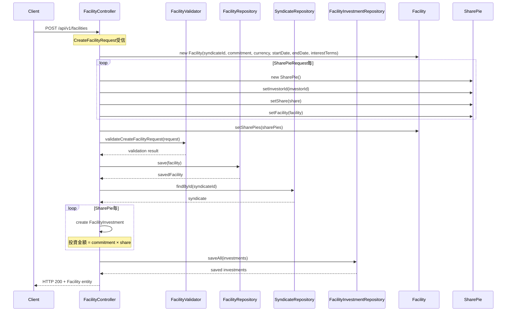

# Facility Bounded Context - Facility作成処理フロー

## 概要

ファシリティ（融資枠）作成処理の流れを説明します。POSTエンドポイント `/api/v1/facilities` を起点とした処理フローを詳述します。

**特徴**: 本システムの設計思想に従い、Controllerに業務ロジックを直接実装し、仕様書とコードの対応を明確にしています。

## 処理フロー概要

1. **CreateFacilityRequest受信** - リクエストデータの受け取り
2. **Facilityエンティティ作成** - コンストラクタを使用したインスタンス生成
3. **SharePieエンティティ作成** - 投資家ごとの出資割合設定
4. **バリデーション実行** - FacilityValidatorによる業務ルール検証
5. **Facility永続化** - ファシリティの保存
6. **FacilityInvestment作成** - 投資家ごとの投資記録生成
7. **FacilityInvestment永続化** - 投資記録の一括保存
8. **レスポンス返却** - 作成されたFacilityエンティティの返却

## シーケンス図



## 詳細実装解説

### 1. エンティティ作成フェーズ

```java
// Facilityエンティティの作成
Facility facility = new Facility(
    request.getSyndicateId(),
    request.getCommitment(),
    request.getCurrency(),
    request.getStartDate(),
    request.getEndDate(),
    request.getInterestTerms()
);

// SharePieエンティティの作成とリスト構築
List<SharePie> sharePies = new ArrayList<>();
for (CreateFacilityRequest.SharePieRequest pie : request.getSharePies()) {
    SharePie entity = new SharePie();
    entity.setInvestorId(pie.getInvestorId());
    entity.setShare(pie.getShare());
    entity.setFacility(facility);  // 双方向関連の設定
    sharePies.add(entity);
}
facility.setSharePies(sharePies);
```

### 2. バリデーション実行

```java
facilityValidator.validateCreateFacilityRequest(request);
```

**注意**: この時点でバリデーションエラーが発生した場合、`BusinessRuleViolationException`がスローされ、Controller層でキャッチされてHTTP 400が返される。

### 3. Facility永続化

```java
Facility savedFacility = facilityRepository.save(facility);
```

この操作により、Facilityエンティティと関連するSharePieエンティティが一括保存される（CASCADE設定により）。

### 4. FacilityInvestment生成ロジック

```java
List<FacilityInvestment> investments = new ArrayList<>();
Money commitment = savedFacility.getCommitment();

// Syndicate情報の取得（借入者IDを取得するため）
Syndicate syndicate = syndicateRepository.findById(savedFacility.getSyndicateId())
    .orElseThrow(() -> new ResourceNotFoundException(
        "Syndicate not found with id: " + savedFacility.getSyndicateId()));
Long borrowerId = syndicate.getBorrowerId();

// 各SharePieに対してFacilityInvestmentを生成
for (SharePie pie : savedFacility.getSharePies()) {
    FacilityInvestment investment = new FacilityInvestment();
    investment.setFacilityId(savedFacility.getId());
    investment.setInvestorId(pie.getInvestorId());
    investment.setBorrowerId(borrowerId);
    investment.setAmount(commitment.multiply(pie.getShare().getValue()));
    investment.setTransactionType("FACILITY_INVESTMENT");
    investment.setTransactionDate(LocalDate.now());
    investments.add(investment);
}
```

**重要な計算ロジック**: 
- `investment.setAmount(commitment.multiply(pie.getShare().getValue()))`
- 投資金額 = ファシリティ総額 × 投資家の出資割合

### 5. 投資記録の一括保存

```java
facilityInvestmentRepository.saveAll(investments);
```

### 6. 例外処理パターン

```java
try {
    // メイン処理
    return ResponseEntity.ok(savedFacility);
} catch (BusinessRuleViolationException ex) {
    return ResponseEntity.badRequest().body(ex.getMessage());
} catch (ResourceNotFoundException ex) {
    return ResponseEntity.status(404).body(ex.getMessage());
} catch (Exception ex) {
    return ResponseEntity.status(500).body("Internal error: " + ex.getMessage());
}
```

## 技術的特徴

### Controller中心設計の実装

本システムの特徴的な設計思想である「Controller中心設計」が以下の点で実現されています：

1. **複雑な業務ロジックの直接実装**
   - FacilityInvestment生成ロジック
   - 投資金額計算（コミットメント × 出資割合）
   - 複数エンティティの連携処理

2. **複数Repositoryの直接利用**
   - FacilityRepository
   - SyndicateRepository  
   - FacilityInvestmentRepository

3. **トランザクション境界の明確化**
   - 1つのHTTPリクエストが1つのトランザクション
   - ロールバック時の影響範囲が明確

### エラーハンドリング戦略

- **BusinessRuleViolationException**: 業務ルール違反（HTTP 400）
- **ResourceNotFoundException**: リソース不存在（HTTP 404）
- **Exception**: システムエラー（HTTP 500）

各例外タイプに応じた適切なHTTPステータスコードとエラーメッセージを返却。

## 関連エンティティ

### Facility
- 主集約ルート
- SharePieとの1対多関係
- 楽観的ロック（version）実装

### SharePie
- 投資家の出資割合を表現
- Facilityとの多対1関係
- 出資割合の合計が100%になることをバリデーションで保証

### FacilityInvestment
- 投資家ごとの投資記録
- 投資金額の実数値を保持
- トランザクション履歴として機能
